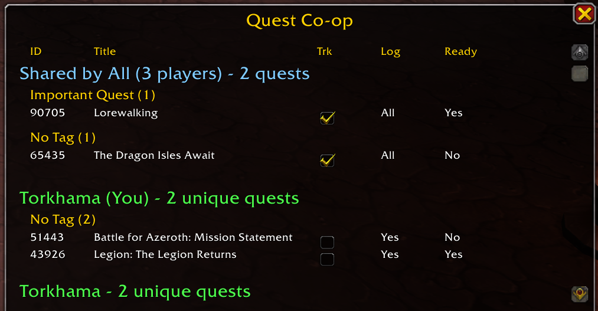

# QuestCoop - Party Quest Coordination Addon

## Overview
QuestCoop is a World of Warcraft addon that helps party members coordinate their quests by sharing quest information in real-time. Perfect for leveling with friends, dungeon groups, or any party content where quest coordination matters.



## Features

### 📊 Shared Quest Visibility
- **See All Party Quests**: View all quests from every party member in one organized window
- **"Shared by All" Section**: Instantly see which quests everyone in the party has
- **Individual Quest Sections**: See unique quests that only specific party members have
- **Real-Time Sync**: Quest information updates automatically as party members accept, complete, or abandon quests

### 🎯 Party-Wide Quest Tracking
- **Coordinated Tracking**: When you track a shared quest, all party members automatically track it
- **One-Click Coordination**: Enable tracking for the entire party from the shared quests section
- **Smart Organization**: Quests grouped by type (Dungeon, Raid, Important Quest, etc.)

### 📋 Quest Information Display
- **Quest ID & Title**: See the quest name and ID for easy reference
- **Tracking Status**: See which quests you're actively tracking
- **Completion Status**: Know when quests are ready to turn in
- **Tag Organization**: Quests automatically grouped by type for easy navigation

### 🚫 Privacy Features
- **Hidden Quest Filtering**: Hidden quests are automatically excluded from sharing

## Installation
1. Download the QuestCoop addon
2. Extract the contents into your World of Warcraft addons directory:
   - **Retail**: `World of Warcraft/_retail_/Interface/AddOns/`
   - **Classic**: `World of Warcraft/_classic_/Interface/AddOns/`
3. Ensure the folder structure is:
   ```
   QuestCoop/
   ├── src/
   │   ├── QuestCoop.lua
   │   └── QuestCoop.xml
   ├── QuestCoop.toc
   ├── LICENSE
   └── README.md
   ```
4. Restart World of Warcraft or type `/reload` in-game

## Usage

### Opening the Quest Window
- Click the **"Quest Co-op"** button that appears on your screen
- The button can be dragged to reposition it anywhere you like
- Your button position is saved between sessions

### Understanding the Display

**Shared by All (X players) - Y quests**
- Shows quests that every party member has
- Use the tracking checkbox here to track for everyone
- Great for coordinating which quest to focus on together

**Player Name (You/Other) - X unique quests**
- Shows quests unique to each player
- Helps identify what each person needs to complete
- Players with no unique quests won't be shown

### Quest Information Columns
- **ID**: Quest identification number
- **Title**: Quest name (hover for full details)
- **Trk**: Checkbox to track/untrack the quest
- **Log**: Shows if quest is in your log (or "All" for shared quests)
- **Ready**: Shows if quest objectives are complete and ready to turn in

### Tooltips
- **Hover over any quest** to see detailed information:
  - Full quest title
  - Quest ID
  - Category and tags
  - Which party members have/track/completed the quest

### Tips
- Hold **Shift** while clicking the button to also print quest IDs to chat
- The window auto-refreshes when party members join/leave or quests change
- Works with parties of any size

## Requirements
- World of Warcraft (Retail or Classic)
- Must be in a party or raid group to see other members' quests

## Troubleshooting

**Button not showing after install?**
- Type `/reload` to reload the UI
- Ensure the addon is enabled in the AddOns list at character selection

**Not seeing party members' quests?**
- Make sure you're in a party/raid group
- Other party members must also have QuestCoop installed
- Check that the addon is enabled for all party members

**Quest information not updating?**
- Quest data syncs when quests are accepted/completed/tracked
- If stuck, type `/reload` to force a refresh

## License
This project is licensed under the MIT License. See the LICENSE file for details.